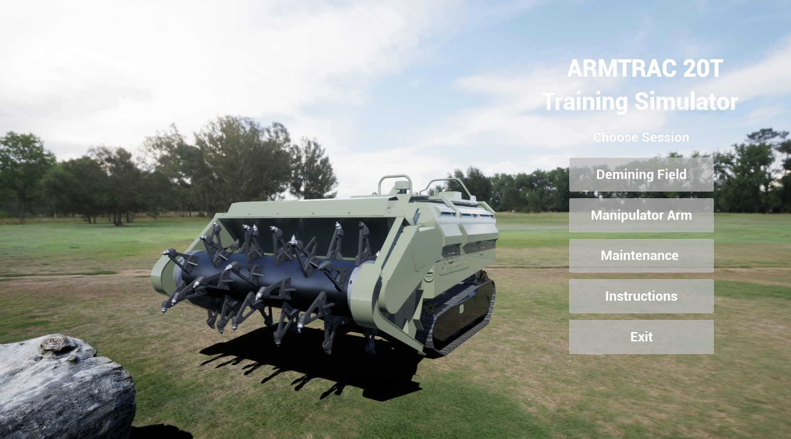
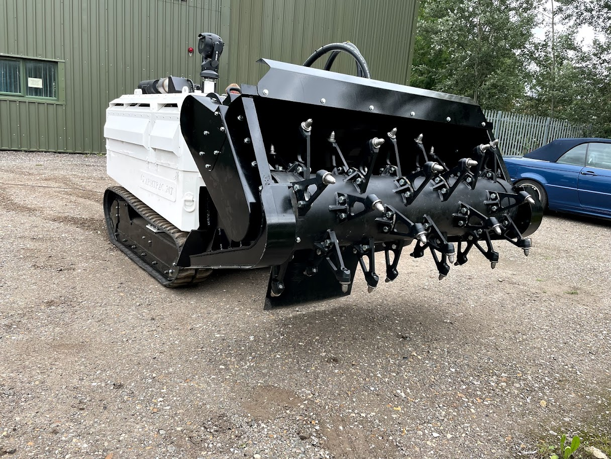
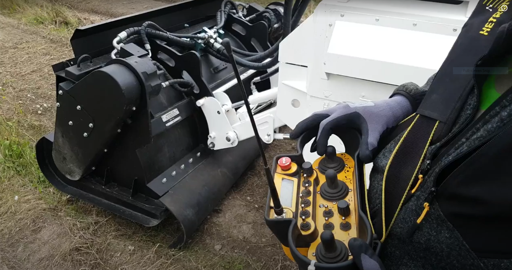
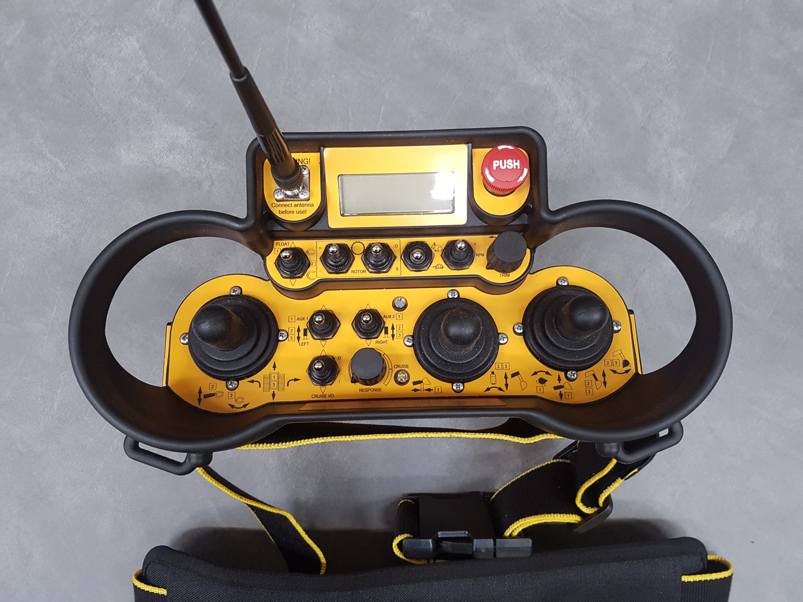
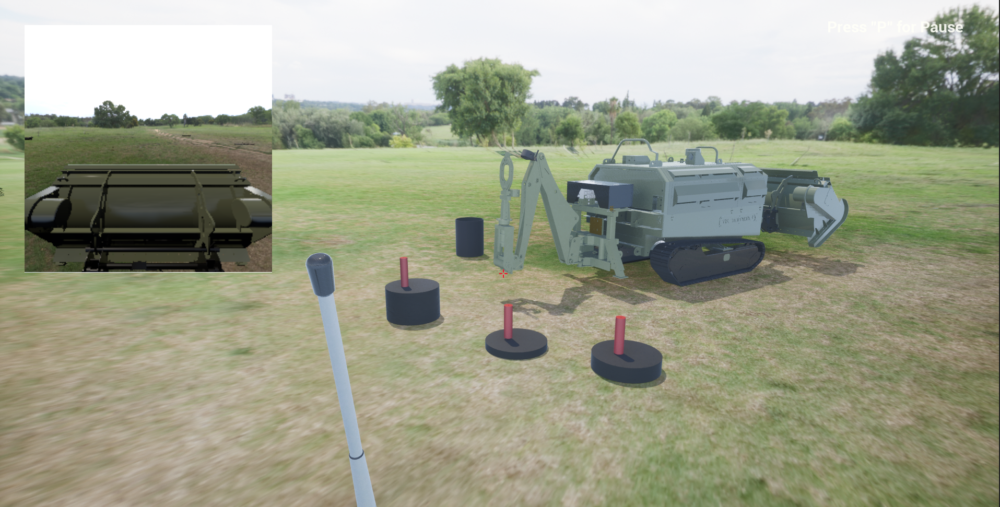

# 🛠️ Digital Demining Machine Simulator

TRAINING SIMULATOR
Introduction

The purpose of the training simulator was to create a digital twin of an unmanned, remotely controlled vehicle. It allows better and longer training for the demining team. Also, it has the same features and functionalities as the real-life vehicle, which provides an excellent option for the trainees to improve their skills and become better operators.

ARMTRAC 20T C-IED ROBOT MK2
Unmanned Ground Vehicle

The simulator has different levels with tasks which represent real-life situations. The aim was to help the trainees practice more hours working with the machines and going through different scenarios, from learning how to control the basic movements to working with the robotic arm tool, from reading the instruction manuals and diagrams to training how to perform mechanical and hydraulic maintenance completely.

LEVELS AND TASKS
Real-life situations

The project contained four levels of training: Demining field, Robotic Arm, Maintenance and Instructions. The levels were created with the support of the company's professionals, who have more than 20 years of technical experience. The training simulation copies the real-life training, but it could be performed at any time, regardless of the place and the weather conditions.

## 🎬 Video Demo

Watch a short demonstration of the simulator in action:

➡️ (https://drive.google.com/file/d/1gC-lplO1elJuUa2JLByl2ite0EKcl_HI/view?usp=sharing)

---

## 🖼️ Screenshots

### 🧭 Overview of Training Simulation

|  |  |  |
|-----------------------------|-----------------------------|-----------------------------|
|  |  |  |
|  |  |  |

> These images showcase the machine UI, environment setup, training interface, and real control integration.

---

## ✅ Key Features

- Real-time control of a simulated demining vehicle
- Functional UI elements and training feedback
- Blueprint-only logic (no C++) for rapid prototyping
- 3D environment based on realistic terrain setups
- Modular design for future hardware integrations

## ✅ Realistic Control System

As part of this simulator, we also developed a **functional replica of the machine’s original remote control**, using:

- **Arduino Leonardo and Mega boards**
- **3D-printed custom enclosure and buttons**
- Integration with the simulator via USB HID signals (keyboard emulation)

> This hardware replica mirrors the actual interface used in real-life training and enables a fully immersive experience when combined with the simulation.

---

## 🧰 Built With

- Unreal Engine 5.4
- Blueprint Visual Scripting
- Niagara Particle Systems
- Custom UI Widgets
- Post Processing & Virtual Lighting Setup

---

## 📌 Notes

- This simulator was developed for training and demonstration purposes only.
- All assets and interactions are custom-designed or sourced under license.
- Contact me for collaboration or custom adaptation to your training hardware.

---

## 📃 License

This project is provided as a **demo only**. Redistribution or commercial use is not allowed without permission.
